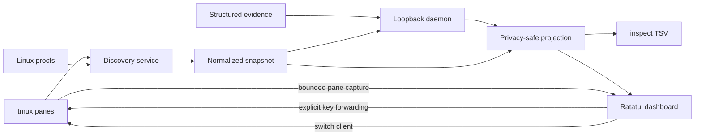

# Architecture

agentmux is a Rust terminal application with a read-only discovery pipeline, an optional local state daemon, and a Ratatui dashboard. The dashboard can continue operating through in-process discovery when the daemon is unavailable.

## System overview



## Components

### CLI

`src/cli.rs` defines three commands: `dashboard`, `inspect`, and `daemon`. Running the binary without a command opens the dashboard when attached to an interactive terminal.

### Discovery

The discovery service requests all local panes with `tmux list-panes -a`. Each row is parsed into typed pane identity and location data. On Linux, procfs traversal starts at the pane PID and finds supported foreground agent executables in the descendant process tree.

Classification requires an exact normalized executable basename. Arguments do not affect matching, and a `.exe` launcher suffix is normalized. A pane is omitted from the dashboard if foreground evidence does not identify a supported agent.

### State and projection

Discovery produces a normalized snapshot keyed by pane-derived agent identity. The projection layer converts it to stable, privacy-safe rows consumed by both `inspect` and the dashboard.

The projected TSV fields are:

```text
agent_id session_name window_index window_name pane_id pid process_name client client_confidence workspace state evidence_source evidence_freshness evidence_confidence
```

Session and window names are represented as `unknown` at this boundary. Workspace values are sanitized basenames rather than full paths.

### Terminal preview and status

The dashboard captures discovered agent panes to refine their live states, while retaining preview content only for the selected row after the initial refresh. `tmux capture-pane -e -J` preserves ANSI styling and joins soft-wrapped terminal rows. Captures are bounded to the newest 32,000 characters so the composer and status footer remain available.

The preview removes OSC hyperlinks and neutralizes underline attributes that can leak from truncated terminal sequences. Plain text is wrapped by Ratatui; ANSI terminal snapshots preserve their terminal layout.

Current terminal markers refine interactive Codex and OpenCode states. Marker precedence is based on the latest relevant line, and a per-pane tracker requires two idle observations before replacing an active state. Capture failure retains the last stable status.

### Dashboard

Application state owns rows, selection, sidebar visibility, help visibility, input mode, and degraded status. Rows are sorted by workspace and pane identity so keyboard traversal matches visual project grouping.

The event loop:

1. Refreshes before the first populated draw.
2. Redraws and polls input with a bounded timeout.
3. Refreshes every second or immediately after navigation/input.
4. Preserves the last good rows when refresh fails.

In browsing mode, dashboard keys update selection and UI state. In input mode, supported key events are translated to tmux key names and sent only to the selected pane.

### Pane switching

When the dashboard starts inside tmux, it installs a temporary prefix-table binding for `A` targeting the dashboard pane. `Enter`/`o` calls `tmux switch-client` for the selected agent pane. The process remains alive in its original pane, and prefix + `A` switches the client back. The binding is removed when the dashboard exits.

### Daemon

The optional daemon listens on `127.0.0.1:47631` by default and rejects non-loopback addresses. It polls fallback discovery, stores normalized state in memory, and exposes:

- `GET /health` — health and current revision
- `GET /state` — current privacy-safe TSV projection
- `GET /events` — server-sent snapshot events
- `POST /evidence` — structured waiting-state evidence, limited to 4096 bytes

The dashboard prefers daemon state. If no daemon is reachable, it can start a child daemon; if daemon startup or communication fails, it uses the same discovery service in process.

## Evidence precedence

Structured evidence may overlay waiting states on a live fallback row. Sources are ranked:

1. Hook
2. Marker
3. Structured log
4. tmux/process fallback

Higher sequence numbers win within a source. A `clear` event removes that source's override. Missing or exited pane evidence always wins over a waiting overlay.

## Failure boundaries

- Malformed tmux output fails safely without exposing raw private values.
- Procfs denial, process exit races, and incomplete process trees degrade the affected evidence to unknown.
- A pane capture error affects terminal-state refinement and preview content, not discovery of the row.
- Invalid daemon responses trigger in-process fallback.
- Dashboard refresh errors retain the last successful projection.

## Current platform boundaries

The production collector is Linux-specific because it relies on procfs. The daemon is local and in-memory; it is not a remote coordination service or durable database. Client status parsing intentionally remains conservative because terminal layouts can change between client versions.
