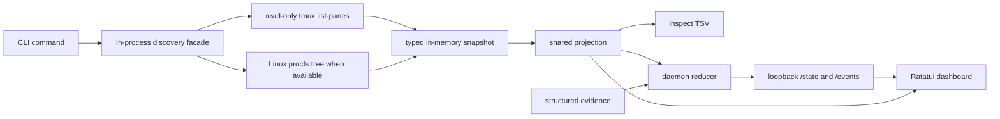
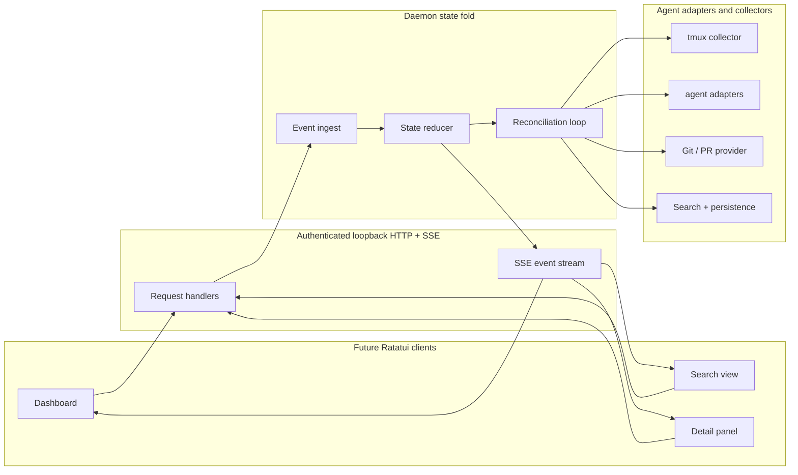
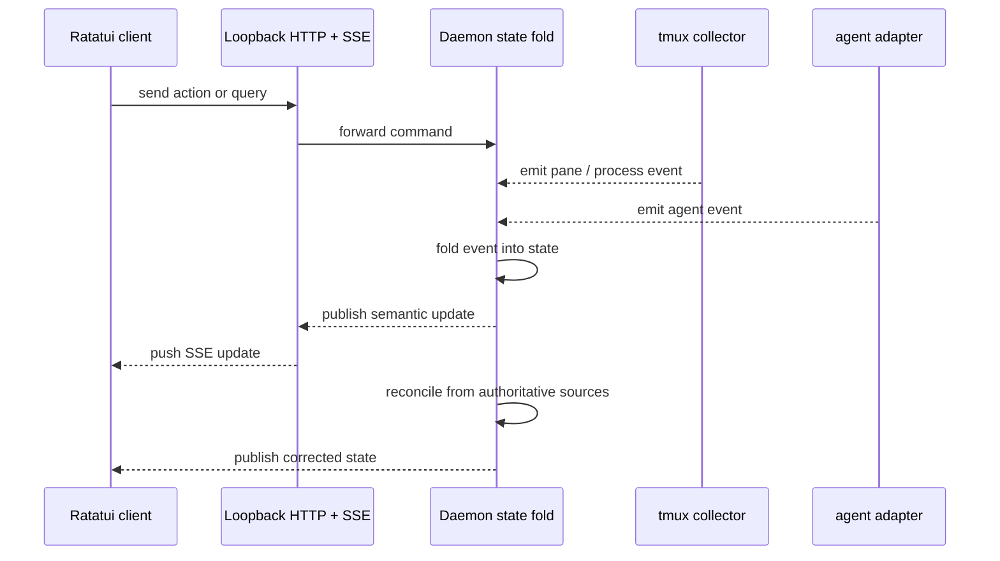

# agentmux Architecture

## Scope

The current implementation includes the CLI entrypoint, a synchronous Ratatui dashboard, the Phase 2 local discovery tracer, and a loopback live daemon slice. Local discovery still owns strict tmux pane collection, Linux procfs process-tree evidence when available, conservative low-confidence client candidate classification, the shared presentation projection, and one-shot `agentmux inspect` output. The daemon adds in-memory authoritative waiting-state evidence, loopback HTTP/SSE state, and dashboard daemon-first fallback.

Client-specific authoritative adapters, persistence, Git / PR provider, previews, actions, search persistence, non-loopback transport, terminal-content adapters, and richer dashboard surfaces below remain future architecture.

## Current capabilities vs planned

| Area | Current | Future |
| --- | --- | --- |
| UI | Synchronous Ratatui dashboard with initial refresh, 1-second automatic refresh, manual `r` / `R` refresh, and `q` / Esc / Ctrl-C quit; it prefers daemon `/state` and falls back to in-process discovery | Multi-client dashboard surfaces, previews, actions, search, grouping, and repository views |
| Transport | Loopback-only std HTTP/SSE subset for `/health`, `/state`, `/events`, and `/evidence` | Authentication, richer flow control, and persisted multi-client transport hardening |
| State | Typed in-memory fallback snapshots plus daemon-owned authoritative waiting overlays and revisioned projection | Durable daemon state, adapter-specific identity, and persistence |
| Agents | Pane-derived row IDs plus Linux procfs low-confidence basename candidates only | Agent adapters and authoritative identities |
| Tmux | Strict read-only `list-panes` collection behind an in-process discovery facade | Broader safe tmux interaction, polling, and adaptive collection |
| Process evidence | Linux procfs PID/start-time and executable basename evidence; unavailable or conflicting evidence degrades to `unknown` | Platform-specific collectors and authoritative adapter evidence |
| Search | None | Search index plus persistence |
| Git / PR | None | Bounded cached provider |
| Cancellation / flow control | None | Tokio cancellation, backpressure, bounded channels, timeouts |

## Shipped Discovery And Daemon Flow



- `inspect` runs the discovery facade once and writes the shared TSV projection after filtering out non-agent panes.
- `dashboard` first reads daemon `/state`; when the daemon is unavailable or invalid, it runs the same facade synchronously in-process and filters out non-agent panes: initial refresh before first populated draw, automatic refresh every second, manual `r` / `R` refresh, and input polling capped so the UI remains responsive.
- Refresh failures retain the last good dashboard rows and show `Status: degraded - dashboard refresh degraded; showing last good rows`.
- The shipped daemon uses background threads and std-only loopback HTTP/SSE. It does not use async runtime, persistence, Git / PR lookups, previews, actions, non-loopback networking, or terminal-content scraping.

## Shipped Inspect Projection

The shipped inspect header is exactly:

```text
agent_id	session_name	window_index	window_name	pane_id	pid	process_name	client	client_confidence	workspace	state	evidence_source	evidence_freshness	evidence_confidence
```

- `agent_id` remains pane-derived.
- `client` is `opencode`, `codex`, `claude`, `gemini`, or `unknown`.
- `client_confidence` is `low` for an exact supported Linux procfs executable basename and `unknown` otherwise.
- `workspace` is a sanitized basename or `unknown`, not a full path.
- `session_name` and `window_name` are approval-safe labels and render as `unknown`; raw tmux labels do not cross the projection boundary.
- `pid` and `process_name` are selected process evidence when safely available, or `unknown`.

## Planned architecture beyond the shipped daemon slice



### Event Flow



## Shipped Daemon API

- `GET /health` returns plain text with the current revision.
- `GET /state` returns the shared privacy-safe TSV projection, prefixed by `agentmux state`, `revision: <u64>`, and `agents: <N>`.
- `GET /events` returns `text/event-stream`, sends the current snapshot immediately, then sends snapshot events for later revision changes.
- `POST /evidence` accepts newline-delimited structured evidence up to 4096 bytes. It never stores or echoes raw payloads in state rows or parse errors.
- The daemon rejects non-loopback bind addresses.

## Dependency Direction

- The shipped dashboard may use daemon API rows or the existing in-process discovery fallback.
- Future richer Ratatui clients should depend on the daemon API only.
- Current Ratatui rendering consumes only shared projection rows owned by the app model.
- Tmux and procfs interaction stays inside the discovery layer or the one-shot inspect command.
- Adapter and persistence code also stay below the API boundary.

## Authoritative Adapter / Source Precedence

The shipped precedence is conservative: tmux and Linux procfs evidence produce fallback state and low-confidence basename candidates only. They do not prove exact agent identity and they do not infer waiting states.

Structured daemon evidence can overlay waiting states for existing non-exited fallback agents. When evidence conflicts, the daemon resolves authoritative state in this exact order:

1. Hook evidence.
2. Marker evidence.
3. Structured-log evidence.
4. Process tree and tmux pane fallback evidence.

Within one authoritative source, higher sequence wins. `clear` removes the active waiting override for that source precedence position. Exited or missing fallback panes win over waiting evidence. Terminal content patterns remain unimplemented.

## Update Model

- Shipped: synchronous dashboard refresh with daemon-first `/state`, in-process fallback, one-second automatic refresh, manual `r` / `R` refresh, and last-good-row retention on refresh failure.
- Shipped: structured evidence updates increment the daemon revision and publish snapshots over SSE.
- Shipped: in-memory reconciliation overlays authoritative waiting states onto fallback discovery snapshots.
- Future: adaptive capture-pane only increases collection when activity, unread output, or a transition requires it.

## Input Handling

- Safe bracketed paste stays enabled for text input paths.
- Key forwarding is explicit and scoped so the daemon does not leak raw terminal state.
- Docked sidebar resize changes width only and does not move panes.

## Search and Persistence

- Search is backed by persisted indexed state, not by live UI scanning.
- Persistence stores the minimum state needed for fast startup and recovery.
- Search results and persisted state remain daemon-owned.

## Git / PR Provider

- Git and PR lookup is bounded, cached, and time-limited.
- The provider only keeps a fixed working set and expires stale entries.
- UI callers see the cached view through the daemon API.

## Runtime and Flow Control

- Tokio cancellation tokens stop stale work quickly.
- Bounded channels limit fan-out and prevent unbounded queue growth.
- Backpressure is explicit at the API and collector boundaries.
- Timeouts cap slow collectors, searches, and Git / PR lookups.

## Security and Privacy

- Shipped daemon transport is loopback-only and rejects non-loopback bind addresses.
- Sensitive prompts, secrets, full private diffs, procfs cmdlines, environments, terminal content, and full workspace paths stay out of presentation rows.
- The UI renders only the shared projection data needed for the active view.
- Evidence parse errors are sanitized and do not echo raw payloads.
- Future authenticated loopback transport can add stronger local-client controls.

## Degraded Failure Modes

- Shipped: if dashboard refresh fails, the UI retains last good rows and shows a sanitized degraded banner.
- Shipped: if per-pane procfs evidence is unavailable, denied, malformed, or racing process exit, that pane can remain visible with unknown/degraded evidence while other panes continue.
- Shipped: if the daemon is unavailable or returns invalid state, the dashboard falls back to in-process discovery.
- Future: if SSE drops in richer clients, the UI falls back to the last known state and reconnects.
- Future: if a collector stalls, the daemon marks the source stale and continues with the rest of the graph.
- Future: if persistence is missing or stale, the daemon rebuilds state from live collectors.

## Future Only

All of the following remain planned architecture and are not implemented yet:

- Multi-client Ratatui dashboards.
- Authenticated loopback transport beyond the shipped std-only local subset.
- Durable daemon state and persistence beyond the shipped in-memory reducer.
- Authoritative agent adapters and collectors beyond shipped structured evidence ingestion and tmux/procfs fallback evidence.
- Tmux interaction beyond the current read-only `list-panes` tracer.
- Process-tree discovery beyond shipped Linux procfs basename candidate evidence.
- Cross-platform process discovery equivalent to Linux procfs.
- Terminal-content adapters.
- Adaptive capture-pane.
- Safe bracketed paste and scoped key forwarding.
- Docked sidebar resize without pane movement.
- Search persistence.
- Bounded cached Git / PR provider.
- Tokio cancellation, backpressure, bounded channels, and timeouts.
- Security and privacy controls beyond the foundation shell.
- Degraded failure handling beyond the foundation shell.
