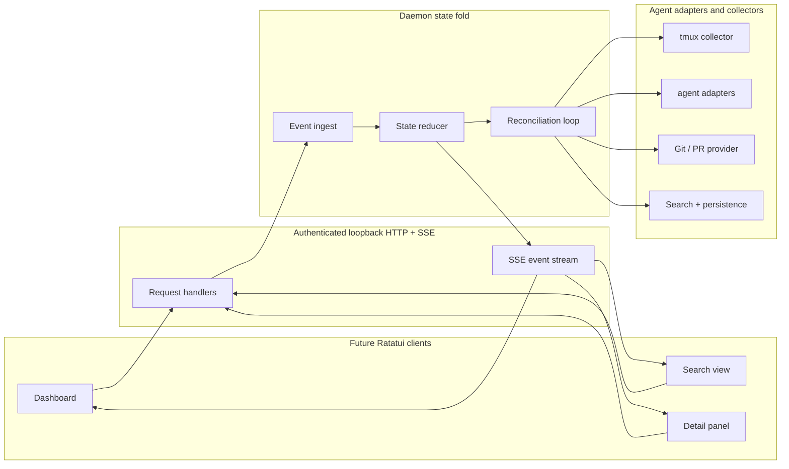
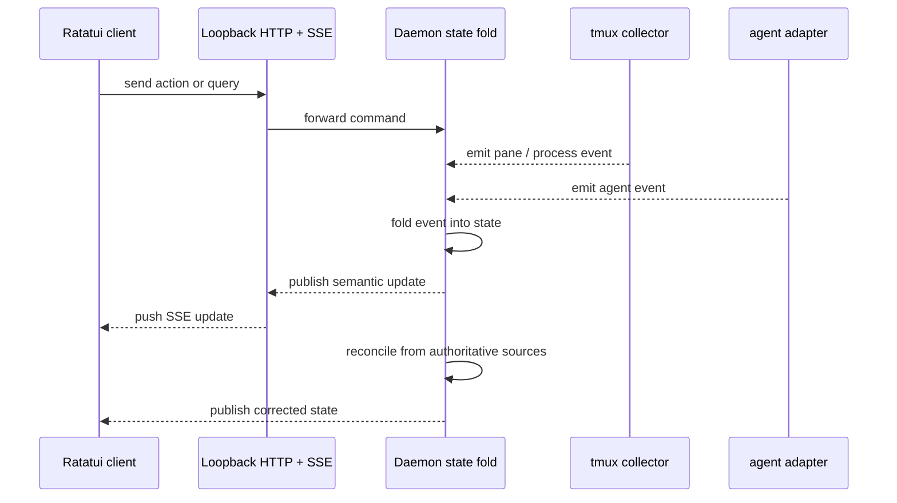

# agentmux Architecture

## Scope

The current implementation includes the CLI entrypoint, an empty-state Ratatui shell, and the
first Phase 2 discovery tracer: typed in-memory state, strict tmux pane collection, conservative
process classification, a daemon-owned in-process discovery facade, and one-shot `agentmux inspect`
output.

The transport, adapters, reconciliation loop, persistence, and richer dashboard surfaces below
remain future architecture.

## Current capabilities vs planned

| Area | Current | Future |
| --- | --- | --- |
| UI | Minimal Ratatui shell | Live agent rows in multiple Ratatui clients connected to the daemon |
| Transport | None | Authenticated loopback HTTP + SSE |
| State | Typed in-memory fallback snapshots and one-shot inspect rendering | Daemon state fold with reconciliation |
| Agents | Pane-derived fallback identities only | Agent adapters and authoritative identities |
| Tmux | Strict `list-panes` collection behind an in-process daemon facade | Broader safe tmux interaction, polling, and adaptive collection |
| Search | None | Search index plus persistence |
| Git / PR | None | Bounded cached provider |
| Cancellation / flow control | None | Tokio cancellation, backpressure, bounded channels, timeouts |

## Planned architecture

### Event Flow

## Dependency Direction

- Future Ratatui clients depend on the daemon API only.
- The UI must not import or call tmux code.
- Tmux interaction stays inside the daemon collector layer or the one-shot inspect command.
- Adapter and persistence code also stay below the API boundary.

## Authoritative Adapter / Source Precedence

When evidence conflicts, the daemon resolves authoritative state in this exact order:

1. Hooks and markers.
2. Structured agent logs and session files.
3. Process tree and tmux pane evidence.
4. Terminal content patterns as the lowest-confidence fallback.

Conflict resolution prefers the highest-ranked fresh source and treats lower-ranked or stale evidence as advisory only.
If the available evidence disagrees and no fresh source can confirm the state, the daemon returns an unknown or degraded outcome instead of inventing certainty.

## Update Model

- Event-first updates publish the semantic change as soon as an event arrives.
- Reconciliation then corrects the state from authoritative sources.
- Adaptive capture-pane only increases collection when activity, unread output, or a transition requires it.

## Input Handling

- Safe bracketed paste stays enabled for text input paths.
- Key forwarding is explicit and scoped so the daemon does not leak raw terminal state.
- Docked sidebar resize changes width only and does not move panes.

## Search and Persistence

- Search is backed by persisted indexed state, not by live UI scanning.
- Persistence stores the minimum state needed for fast startup and recovery.
- Search results and persisted state remain daemon-owned.

## Git / PR Provider

- Git and PR lookup is bounded, cached, and time-limited.
- The provider only keeps a fixed working set and expires stale entries.
- UI callers see the cached view through the daemon API.

## Runtime and Flow Control

- Tokio cancellation tokens stop stale work quickly.
- Bounded channels limit fan-out and prevent unbounded queue growth.
- Backpressure is explicit at the API and collector boundaries.
- Timeouts cap slow collectors, searches, and Git / PR lookups.

## Security and Privacy

- Authenticated loopback transport keeps the daemon local to the machine.
- Sensitive prompts, secrets, and full private diffs stay hidden by default.
- The UI only requests the minimum data needed for the active view.

## Degraded Failure Modes

- If SSE drops, the UI falls back to the last known state and reconnects.
- If a collector stalls, the daemon marks the source stale and continues with the rest of the graph.
- If a source is unavailable, the UI shows a degraded state instead of blocking the whole dashboard.
- If persistence is missing or stale, the daemon rebuilds state from live collectors.

## Future Only

All of the following remain planned architecture and are not implemented yet:

- Multi-client Ratatui dashboards.
- Authenticated loopback HTTP + SSE transport.
- Daemon state fold and reconciliation loops.
- Agent adapters and collectors.
- Tmux interaction beyond the current read-only `list-panes` tracer.
- Process-tree discovery beyond tmux current-command fallback evidence.
- Polling beyond one-shot inspect.
- Adaptive capture-pane.
- Safe bracketed paste and scoped key forwarding.
- Docked sidebar resize without pane movement.
- Search persistence.
- Bounded cached Git / PR provider.
- Tokio cancellation, backpressure, bounded channels, and timeouts.
- Security and privacy controls beyond the foundation shell.
- Degraded failure handling beyond the foundation shell.
