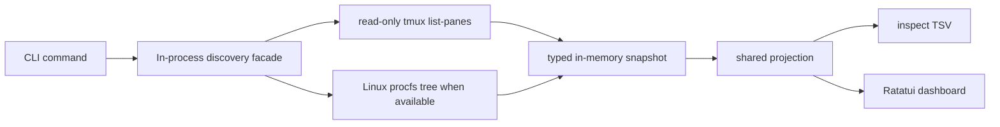
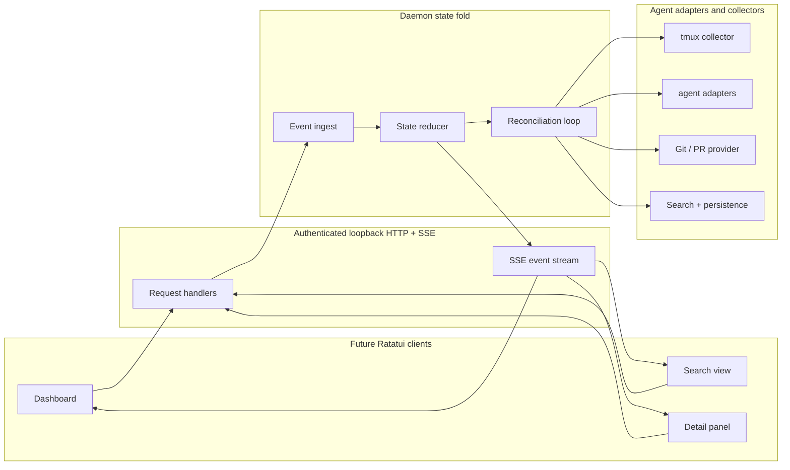
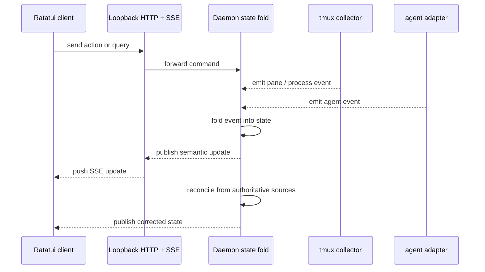

# agentmux Architecture

## Scope

The current implementation includes the CLI entrypoint, a synchronous Ratatui dashboard, and the
Phase 2 local discovery tracer: typed in-memory state, strict tmux pane collection, Linux procfs
process-tree evidence when available, conservative low-confidence client candidate classification,
an in-process discovery facade, shared presentation projection, and one-shot `agentmux inspect`
output.

The HTTP/SSE transport, daemon loops, authoritative adapters, persistence, Git / PR provider,
previews, actions, search persistence, and richer dashboard surfaces below remain future architecture.

## Current capabilities vs planned

| Area | Current | Future |
| --- | --- | --- |
| UI | Synchronous Ratatui dashboard with initial refresh, 1-second automatic refresh, manual `r` / `R` refresh, and `q` / Esc / Ctrl-C quit | Multi-client Ratatui dashboard connected to a daemon API |
| Transport | None | Authenticated loopback HTTP + SSE |
| State | Typed in-memory fallback snapshots, one-refresh tombstones, degraded refresh retention, and shared inspect/dashboard projection | Daemon state fold with reconciliation and persistence |
| Agents | Pane-derived row IDs plus Linux procfs low-confidence basename candidates only | Agent adapters and authoritative identities |
| Tmux | Strict read-only `list-panes` collection behind an in-process discovery facade | Broader safe tmux interaction, polling, and adaptive collection |
| Process evidence | Linux procfs PID/start-time and executable basename evidence; unavailable or conflicting evidence degrades to `unknown` | Platform-specific collectors and authoritative adapter evidence |
| Search | None | Search index plus persistence |
| Git / PR | None | Bounded cached provider |
| Cancellation / flow control | None | Tokio cancellation, backpressure, bounded channels, timeouts |

## Shipped Local Discovery Flow



- `inspect` runs the discovery facade once and writes the shared TSV projection.
- `dashboard` runs the same facade synchronously in-process: initial refresh before first populated draw, automatic refresh every second, manual `r` / `R` refresh, and input polling capped so the UI remains responsive.
- Refresh failures retain the last good dashboard rows and show `Status: degraded - dashboard refresh degraded; showing last good rows`.
- The shipped dashboard does not use HTTP, SSE, background threads, async runtime, persistence, Git / PR lookups, previews, actions, or terminal-content scraping.

## Shipped Inspect Projection

The shipped inspect header is exactly:

```text
agent_id	session_name	window_index	window_name	pane_id	pid	process_name	client	client_confidence	workspace	state	evidence_source	evidence_freshness	evidence_confidence
```

- `agent_id` remains pane-derived.
- `client` is `opencode`, `codex`, `claude`, `gemini`, or `unknown`.
- `client_confidence` is `low` for an exact supported Linux procfs executable basename and `unknown` otherwise.
- `workspace` is a sanitized basename or `unknown`, not a full path.
- `session_name` and `window_name` are approval-safe labels and render as `unknown`; raw tmux labels do not cross the projection boundary.
- `pid` and `process_name` are selected process evidence when safely available, or `unknown`.

## Planned architecture



### Event Flow



## Dependency Direction

- Future Ratatui clients depend on the daemon API only.
- The UI must not import or call tmux code.
- Current Ratatui rendering consumes only shared projection rows owned by the app model.
- Tmux and procfs interaction stays inside the discovery layer or the one-shot inspect command.
- Adapter and persistence code also stay below the API boundary.

## Authoritative Adapter / Source Precedence

The current shipped precedence is conservative: tmux and Linux procfs evidence can produce fallback state and low-confidence basename candidates only. They do not prove exact agent identity and they do not infer waiting states.

Future authoritative evidence will use this order when implemented:

When evidence conflicts, the daemon will resolve authoritative state in this exact order:

1. Hooks and markers.
2. Structured agent logs and session files.
3. Process tree and tmux pane evidence.
4. Terminal content patterns as the lowest-confidence fallback.

Conflict resolution will prefer the highest-ranked fresh source and treat lower-ranked or stale evidence as advisory only.
If the available shipped evidence disagrees, the current implementation returns an unknown or degraded outcome instead of inventing certainty.

## Update Model

- Shipped: synchronous in-process dashboard refresh, with initial refresh, one-second automatic refresh, manual `r` / `R` refresh, and last-good-row retention on refresh failure.
- Future: event-first updates publish the semantic change as soon as an event arrives.
- Future: reconciliation then corrects the state from authoritative sources.
- Future: adaptive capture-pane only increases collection when activity, unread output, or a transition requires it.

## Input Handling

- Safe bracketed paste stays enabled for text input paths.
- Key forwarding is explicit and scoped so the daemon does not leak raw terminal state.
- Docked sidebar resize changes width only and does not move panes.

## Search and Persistence

- Search is backed by persisted indexed state, not by live UI scanning.
- Persistence stores the minimum state needed for fast startup and recovery.
- Search results and persisted state remain daemon-owned.

## Git / PR Provider

- Git and PR lookup is bounded, cached, and time-limited.
- The provider only keeps a fixed working set and expires stale entries.
- UI callers see the cached view through the daemon API.

## Runtime and Flow Control

- Tokio cancellation tokens stop stale work quickly.
- Bounded channels limit fan-out and prevent unbounded queue growth.
- Backpressure is explicit at the API and collector boundaries.
- Timeouts cap slow collectors, searches, and Git / PR lookups.

## Security and Privacy

- Shipped local discovery keeps evidence in-process and does not expose a network transport.
- Sensitive prompts, secrets, full private diffs, procfs cmdlines, environments, terminal content, and full workspace paths stay out of presentation rows.
- The UI renders only the shared projection data needed for the active view.
- Future authenticated loopback transport will keep daemon traffic local to the machine.

## Degraded Failure Modes

- Shipped: if dashboard refresh fails, the UI retains last good rows and shows a sanitized degraded banner.
- Shipped: if per-pane procfs evidence is unavailable, denied, malformed, or racing process exit, that pane can remain visible with unknown/degraded evidence while other panes continue.
- Future: if SSE drops, the UI falls back to the last known state and reconnects.
- Future: if a collector stalls, the daemon marks the source stale and continues with the rest of the graph.
- Future: if persistence is missing or stale, the daemon rebuilds state from live collectors.

## Future Only

All of the following remain planned architecture and are not implemented yet:

- Multi-client Ratatui dashboards.
- Authenticated loopback HTTP + SSE transport.
- Daemon state fold and reconciliation loops.
- Authoritative agent adapters and collectors beyond shipped tmux/procfs fallback evidence.
- Tmux interaction beyond the current read-only `list-panes` tracer.
- Process-tree discovery beyond shipped Linux procfs basename candidate evidence.
- Cross-platform process discovery equivalent to Linux procfs.
- Daemon/event polling beyond shipped synchronous dashboard refresh.
- Adaptive capture-pane.
- Safe bracketed paste and scoped key forwarding.
- Docked sidebar resize without pane movement.
- Search persistence.
- Bounded cached Git / PR provider.
- Tokio cancellation, backpressure, bounded channels, and timeouts.
- Security and privacy controls beyond the foundation shell.
- Degraded failure handling beyond the foundation shell.
